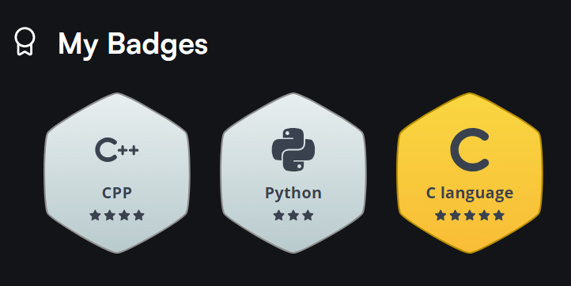

<!--
**Sonali2314/Sonali2314** is a ✨ _special_ ✨ repository because its `README.md` (this file) appears on your GitHub profile.

Here are some ideas to get you started:

- 🔭 I’m currently working on ...
- 🌱 I’m currently learning ...
- 👯 I’m looking to collaborate on ...
- 🤔 I’m looking for help with ...
- 💬 Ask me about ...
- 📫 How to reach me: ...
- 😄 Pronouns: ...
- ⚡ Fun fact: ...
-->
# Hello, I'm Sonali Patil 👋

## ✨ About Me
I’m a third-year B.Tech student in Computer Science and Engineering with a focus on Artificial Intelligence. 
Passionate about AI and Machine Learning, I’m always eager to dive into new technologies and solve interesting problems.  

## 🔭 Currently Working On :
Enhancing my skills in AI and Machine Learning through various projects and coursework. 
Exploring new technologies and contributing to open-source projects.  

## 🌱 Learning :
Advanced concepts in AI and ML. 
Frontend development technologies to build interactive web applications.  

## 🛠️ Tools & Technologies :

### Languages :

  
  &nbsp;&nbsp;&nbsp;&nbsp;
   
  &nbsp;&nbsp;&nbsp;&nbsp;
  
  &nbsp;&nbsp;&nbsp;&nbsp;
  

### Frontend Development :

   
  &nbsp;&nbsp;&nbsp;&nbsp;
  
  &nbsp;&nbsp;&nbsp;&nbsp;
  

### ⚡Tools & Platforms :
 

 
  &nbsp;&nbsp;&nbsp;&nbsp;
  
   &nbsp;&nbsp;&nbsp;&nbsp;
<a href="https://www.vscode.dev/" target="_blank" rel="noreferrer"> 
   
</a
   

## 📫 How to Reach Me :

&nbsp;&nbsp;&nbsp;&nbsp;

 

## ✨ Also see my other profiles:

&nbsp;&nbsp;&nbsp;&nbsp;

## My Badges

## 📊 My GitHub Stats:

### 🌟 Feel free to explore my repositories and don't hesitate to reach out if you have any questions or 🤝 collaboration ideas! 

