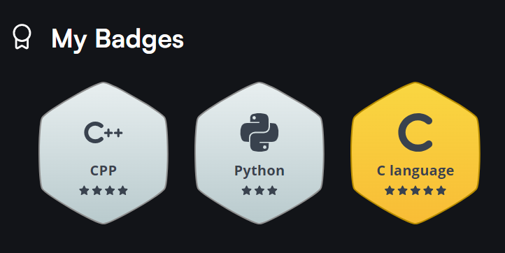

<!-- 💡 Banner -->
<!-- 

  

 -->

<!-- 👋 Typewriter Intro -->

  

---

## ✨ Who Am I?

Hi! I’m **Sonali Patil**, a final-year B.Tech student majoring in **Artificial Intelligence and Machine Learning**.  
I’m passionate about crafting intelligent systems, solving meaningful problems, and making tech human.

> 🎯 *“AI won’t replace you. A person using AI will.”*

I'm constantly learning, building, and experimenting — whether it's a smart healthcare project, a LeetCode streak, or late-night React hacks.

---

## 💼 Quick Snapshot

- 🧠 Final Year | B.Tech CSE (AI)  
- 🌱 Learning: Deep Learning • MERN Stack • Clean UI • ASP.NET & C#  
- 👩‍💻 Former Vice President, AISA Club  
- 🏆 Top 40 Team in Smart India Hackathon  
- 🧩 Self-starter & passionate learner  

---

## 🔥 My Top Projects

### 🔐 MediCard+ – Smart Healthcare System  
A secure, AI-driven medical record management platform for doctors and patients. Built with React, Node.js, and MongoDB.  
> ✅ Used in our capstone project to demonstrate real-time record syncing and health insights.

[→ View Project](https://github.com/Sonali2314/MediCardPlus)

<!--
#### 🖼️ Project Preview:

-->

---
<!--
### 🤖 Disease Prediction ML App  
A Python-based disease predictor trained on symptoms to classify common illnesses using Scikit-learn.

> 🧪 Played with real datasets to simulate diagnostic assistance.

[→ View Repo](https://github.com/Sonali2314/DiseasePredictor)

---

### 🎨 Neural Style Transfer  
A deep learning model that blends content and style images using CNNs. A creative spin on AI + art.

> 💡 Inspired by how AI sees beauty.

[→ Code & Demo](#)

---

### 💬 Resume Analyzer  
A project that parses resumes and compares them with job descriptions using NLP techniques.

> 📄 Helps users get tailored resume insights.

[→ GitHub Link](#)

--- -->

## 🛠️ Tech Stack I Work With

### 👩‍💻 Languages  

  
  
  
  
  
  

### 🌐 Frontend  

  
  
  
  

### 🔧 Backend & Databases  

  
  
  
  
  
  
  

### 🧠 AI & ML  

  
  
  
  
  

### ⚙️ Tools & Platforms  

  
  
  
  
  
  <!--  -->

---

## 📈 GitHub Highlights

<!--    -->
    
  
    
  
<!--    -->

---

## 🔗 Connect With Me!

&nbsp;

---

## 💻 Coding Profiles

&nbsp;

---
<!--
## 🏅 HackerRank Badges

--- -->

## 😄 Fun Facts

- ⚡ I vibe with code more than coffee  
- 🎧 I write better code with lo-fi beats on loop  
- 🌱 I love exploring new tech just for fun  
- 🧩 Debugging is my second language  

---

## 👀 Visitors

⭐️ Thanks for visiting! Let's connect and collaborate!

